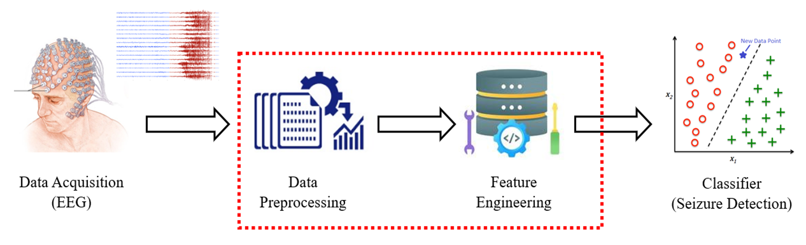

# Signal Processing Techniques to Improve Feature Space for EEG-based Epileptic Seizure Detection

<p align="justify"> 
Bio-signal processing is an evolving field of science that is critical in the diagnosis, and prognosis of diseases and timely intervention to reduce the impact of the disease on the patients. In recent years, the research interests have been largely shifted to analyze the functionality of the brain to identify the structural and functional changes and characteristics that correspond to different types of neurological disorders including epileptic seizures, and Alzheimer’s. In this project, the broad objective is oriented toward detecting epileptic seizures by analyzing Electroencephalography (EEG) signals recorded in-vivo from the patients diagnosed with the disease. 
</p>



## Dataset

<p align='justify'>
For this project, a publicly available Epileptogie dataset [1] is used which consists of 5 subsets, each containing 100 EEG segments. The data is sampled at a sampling rate of 173.61 Hz which is recorded using a 128-channel amplifier system with an average common reference. The recorded signals have a spectral bandwidth of 0.5 Hz to 85 Hz. These continuous multichannel EEG recordings from multi-spatial locations are segmented into 
23.6s long epochs after visually inspecting the presence of any artifacts [1]. For this project, I selected Intracranial EEG signals that are captured within hippocampus formation.
</p>

|Properties of Dataset               |Values                   |
|------------------------------------|:-----------------------:|
|Sampling Frequency                  |173.63Hz                 |
|Inter-Ictal EEG Signal Dataset (D)  |100 segments             | 
|Ictal EEG Signal Dataset (E)        |100 segments             |
|Recording Site                      |Hippocampus Formation    |
|Type of Data                        |Intracranial EEG (iEEG)  |
|Segment Length                      |23.6s (4097 samples)     |


## Techniques Analyszed
For the details on the techniques analyzed, please refer to Section 2 of the [Report](docs/Kalana Abeywardena - BME 1473 - Project Report Final.pdf).
### 

## References
```
[1] I. Ullah, M. Hussain, E. ul H. Qazi, and H. Aboalsamh, “An automated system for epilepsy detection using EEG brain signals based on deep learning approach,” Expert Syst Appl, vol. 107, pp. 61–71, Oct. 2018.
[2] J. L. Semmlow and B. Griffel, “BIOSIGNAL and MEDICAL IMAGE PROCESSING Third Edition.”
[3] 
```
